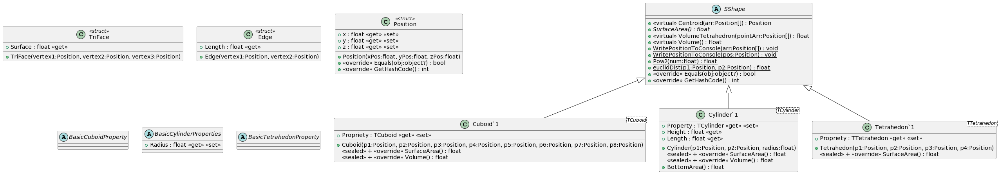

# C# Development: Gerometry librariy
**_Deeper understanding of classes and innheritance. Introduction to geometries in 3D space_**

---
## Objectives

The objectives of this assignement is to create a geometry library that can be used to create shapes in a 3D space.

All the shapes are coming with calculations related to volume, centroid, surface area...

## Entry point: Main

The entry point is here just an experimentation for performance comparison. There are two command that can be typed 
> dotnet run

and
> dotnet run -thread

This two commands are showing two different strategies of displaying informations in the terminal using tasks or not.


## Library

### 1. ***Inheritance choice***
I decided to crerate a SShape, an abstract class that would pass properties and methods to the other class that extend it.

All of the classes need to have a SurfaceArea() method and to override the == operator. I decided to use abstract methods when my classes (3D shapes) needed to implement it and virtual methods when it could be used or overriden.

### 2. ***Struct***
In order to create my classes I decided to create my own data types using struct.
- Position: This represents a vertex in a 3D space. It takes 3 float for the x, y and z value to assign a position. I also decided to override the '==' operator in order to make later method/comparison easier. Comparing to Position using '==' would return true if the Position have the same coordinates.
```csharp
          public static bool operator ==(Position a, Position b)
        {
            return a.x == b.x && a.y == b.y && a.z == b.z;
        }
```
- Edge: I have an Edge data type to store an edge between two connected vertices. This struct allow me to calculate a magnitude/length to use in other methods.
```csharp
        public Edge(Position vertex1, Position vertex2) {
            this._vertex1 = vertex1;
            this._vertex2 = vertex2;
            this._length = MathF.Sqrt(
                MathF.Pow(vertex2.x - vertex1.x, 2) +
                MathF.Pow(vertex2.y - vertex1.y, 2) +
                MathF.Pow(vertex2.z - vertex1.z, 2)
            );
        }
```
- TriFace: Most of my calulation are based on triangles. Every TriFace hold an array of vertices and an array of edges. The array of vertices is generated on instanciation using the Position data type.
```csharp
TriFace example = new Triface(Position1, Position2, Position3)
``` 
Then this struct hold a surface method to return the surface of the face:
```csharp
        // Heron's formula
        this._semiPerim = (_edges[0].Length + _edges[1].Length + _edges[2].Length) / 2;
        this._surface = MathF.Sqrt(
                _semiPerim *
                (_semiPerim - _edges[0].Length) *
                (_semiPerim - _edges[1].Length) *
                (_semiPerim - _edges[2].Length)
        );
```
These struct allowed me to create data types that facilitate calculation in the methods I used to return volume, centroid...

### 3. ***Abstract class***

My abstract SShape is my 'super' class from which.
The only field is an array of vertices. All my shapes are composed of at last two vertices and this field is used in different methods.
As explained earlier, I decided to have abstract methods, virtual methods regarding is the children classes needed to implement the method or not.
I also chose to have some non-static methods to call them on an instance as it was in my opinion a more logical call:
> ExampleCube.Volume()

And some static methods, that can be called anytime not related to an instance, such as: 
```csharp
public static void WritePositionToConsole(Position pos) {
            System.Console.WriteLine($"x: {pos.x}, y: {pos.y}, z: {pos.z}");                     
        }
```


### 4. ***Instatiable classes***

For all my children classes, I decided to use some generics to make them more flexible to use in the future and to review the concept saw in class.
For example, in my Tetrahedron class:
```csharp
    public abstract class BasicTetrahedonProperty {

    }
    public class Tetrahedon<TTetrahedon> : SShape where TTetrahedon : BasicTetrahedonProperty, new ()
```

To follow-up on the vertices array in the parent class, I defined in the children class the lenght of the array and fill it on instance:
```csharp
       public Tetrahedon(Position p1, Position p2, Position p3, Position p4) : base(4) {  
            _triFaces = new TriFace[] {
                new TriFace(p1, p2, p3), 
                new TriFace(p1, p2, p4), 
                new TriFace(p1, p3, p4), 
                new TriFace(p2, p3, p4)            
            };
            _vertices = new Position[] { p1, p2, p3, p4 };
       }
```
Here I create a new Tetrahedron using the constructor of parent class:
```csharp
        protected SShape(uint nVertices) {
            _vertices = new Position[nVertices];
        }
```

As all my calculations are based on a non-regular shape, I sealed the methods I overrided.

My 3 children classes are:
- Tetrahedron
- Cuboid
- Cylinder

## Class Diagram


